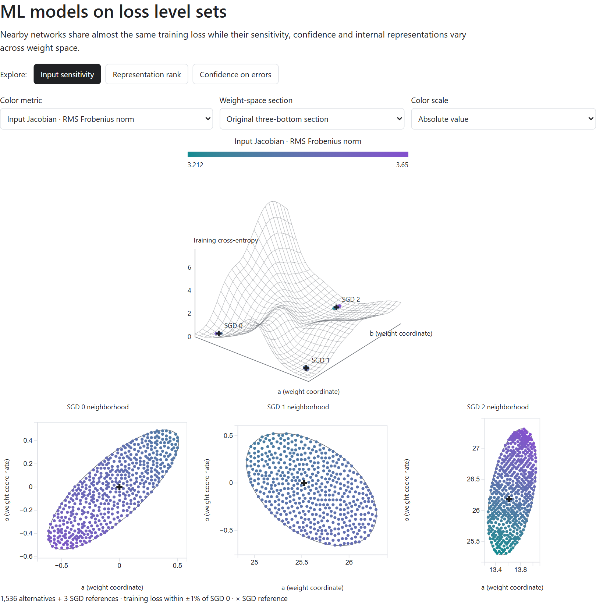
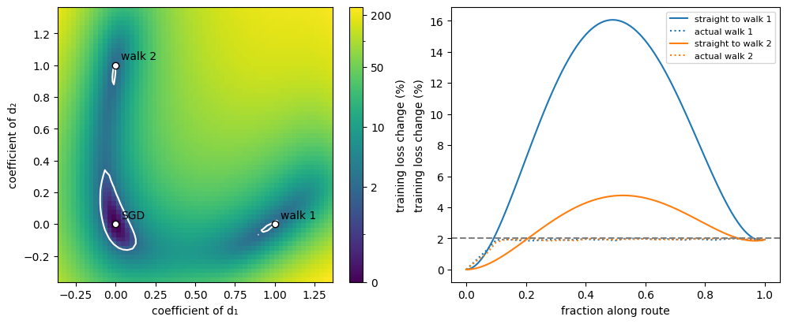
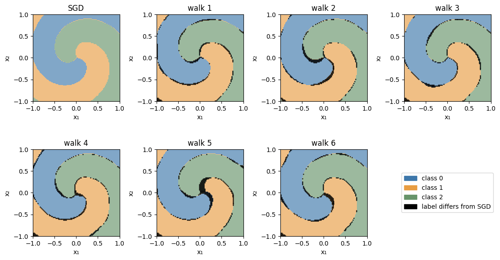
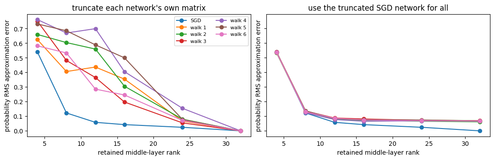
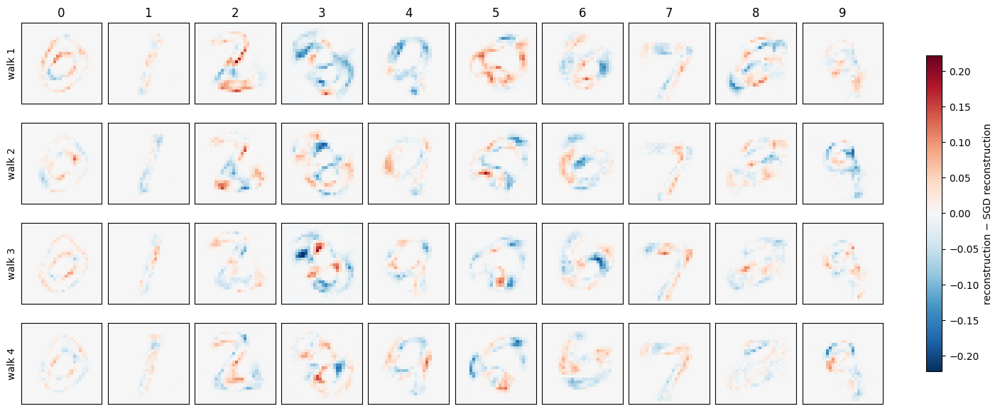

# ML Models on Loss Level Sets

A training loss summarizes how well a model fits the training data.
Different predictions can produce the same average error: one function may fit
some inputs more closely than others. The same score can therefore
belong to functions with different decision boundaries, sensitivities and
allocations of error.

I examined models with the same architecture and approximately the same training
loss, but different sets of parameters, to see how they differ and whether there
is value in exploring alternatives around a converged model.

Suppose SGD has reached a point where further training changes the loss very
little. What freedom remains in the function it has learned? Can the weights
move while preserving approximately that loss, and what mathematical properties
change along the way?

This can be written as:

```math
\theta\;\longmapsto\;f_\theta\;\longmapsto\;L_{\mathrm{train}}(f_\theta).
```

The first map turns the weights into a function (by putting them into a model
architecture, so to speak).
The second evaluates that function on the training data. A hidden-neuron permutation gives different weights for
the same function. At the next level, different functions can have the same
loss. Exploring around a trained network makes both relationships concrete.

## An interactive view of the loss landscape

In an additional classifier example, three independently trained spiral networks
define a two-dimensional section of weight space. Around each SGD solution,
sampled networks stay within a common
1% training-loss band. Their properties form fields over the same landscape.

[](https://mikolaj-mlp.github.io/ml-models-on-loss-level-sets/)

**[Explore the landscape](https://mikolaj-mlp.github.io/ml-models-on-loss-level-sets/)**

- [Input sensitivity](https://mikolaj-mlp.github.io/ml-models-on-loss-level-sets/#metric=jacobian_frobenius_rms&plane=raw&mode=absolute)
  forms clear directional gradients within the low-loss regions.
- [Representation rank](https://mikolaj-mlp.github.io/ml-models-on-loss-level-sets/#metric=hidden2_stable_rank&plane=raw&mode=absolute)
  separates the three neighborhoods more strongly than it varies inside them.
- [Confidence on errors](https://mikolaj-mlp.github.io/ml-models-on-loss-level-sets/#metric=test_error_confidence&plane=raw&mode=absolute)
  changes smoothly as the weights move across each neighborhood.

The selector contains 76 measured statistics, including class-wise errors,
noise response, probability differences, input derivatives and matrix spectral statistics.
Each metric retains a shared color scale across all three neighborhoods and
both the original and neuron-aligned sections.

## From a trained point to a loss neighborhood

Take the weights $`\theta_0`$ at an observed SGD plateau. Writing
$`L(\theta)=L_{\mathrm{train}}(f_\theta)`$, allow an absolute loss difference
$`\varepsilon`$ and consider

```math
\mathcal N_\varepsilon=
\{\theta:|L(\theta)-L(\theta_0)|\le\varepsilon\}.
```

The reference loss can be positive. Its value fixes the level around which the
weights are explored.

Random directions are projected onto the local tangent plane of the loss level
where its gradient is nonzero. Finite steps are checked against the loss band,
with gradient corrections for proposals that leave it. This produces paths
guided by the training-loss constraint. The resulting functions can then be
compared through predictions, matrix spectra and input derivatives.

The first example is a neural classifier trained on three interleaved spiral
regions. Its two-dimensional input space makes changes in the learned decision
boundaries visible. The second is an MNIST autoencoder, where each prediction
is a reconstructed image.

## Ridges and curvature around the trained network

The classifier provides a first geometric question: how are the reached weights
arranged around the SGD reference? A loss section through two endpoints contains
small near-reference-loss regions separated by higher loss. In the displayed
routes, straight interpolation crosses a ridge while the recorded exploration
states stay inside the admissible band.



The colored surface evaluates loss on the affine plane through the reference
and two endpoints. The recorded walks travel through the larger weight space,
with loss checked at each accepted state. The Hessian supplies a quadratic
approximation near the reference; along a long displacement, that approximation
substantially overpredicts the measured loss!

## Prediction differences near class boundaries

Having reached other weights, the next question is what happened to the
represented function. A neuron permutation provides a useful reference case:
the parameters move while the predicted probabilities remain unchanged to
roundoff.

The random-walk endpoints disagree with the reference on roughly three to four
percent of evaluation-grid labels. The changes cluster near ambiguous class
boundaries, where small probability changes can exchange the winning class.



The alternatives also allocate mistakes differently among classes. Their overall
accuracy moves less than some class-wise recalls, and their calibration differs.
They also disagree with one another at still more closely matched losses:
similar aggregate scores accompany different assignments of predictions to
individual inputs.

## Low-rank approximations of nearby functions

The changed predictions lead to an algebraic question: how does the structure
of the weight matrices relate to the functions they represent?

In the classifier, the middle-layer stable rank increases along the walks while
the probability functions remain close. Stable rank measures how spread out a
matrix's singular values are. To connect this change to approximation, truncate
each network's middle matrix and measure the resulting change in predictions.

A second approximation is available through the nearby SGD function. At each
rank, truncate the SGD network's middle matrix and compare that shared candidate
with every alternative.

Let $`q_i`$ be an alternative's probability function, $`q_0`$ the reference, and
$`\widetilde q_{0,r}`$ the reference after rank-$`r`$ truncation. For RMS distance
$`d`$ on fixed evaluation inputs, the triangle inequality gives

```math
d(q_i,\widetilde q_{0,r})
\le d(q_i,q_0)+d(q_0,\widetilde q_{0,r}).
```

Thus closeness to the reference supplies a bound on the shared approximation
error. A rank-$`r`$ factorization of an $`m\times n`$ matrix uses $`r(m+n)`$
coefficients, reducing storage when
$`r(m+n)<mn`$.



Here the truncated reference approximates every alternative much more closely
than truncating the alternative's own matrix at the same low rank. The functions
remain close to a common low-rank representation as their own matrices become
harder to truncate.

Input-Jacobian spectra describe the function's response to input perturbations.
In these networks, the increase in middle-layer stable rank accompanies a range
of input sensitivities.

## Stroke differences and error redistribution

Reconstruction makes the question visible at the level of individual pixels.
The MNIST autoencoder maps an image through a narrow latent vector and back to
pixel intensities. Its mean squared loss combines the errors across all those
pixels and images.

Weight exploration produces subtle changes in reconstructed strokes. The
reconstruction differences subtract the SGD network's reconstruction from each
alternative's reconstruction of the same image.



Each alternative reconstructs more than a quarter of the test images more
accurately while average test error rises. Mean error also rises within every
digit class. Per-image measurements reveal how improvements and deteriorations
are distributed within those classes.

The layer singular spectra remain nearly unchanged and average input sensitivity
changes only slightly across these distinct reconstruction functions. The
architecture imposes a common constraint. Writing the encoder as $`E`$, the
decoder as $`D`$, and the latent dimension as $`r`$, the chain rule gives

```math
J_f(x)=J_D(E(x))J_E(x),\qquad \mathrm{rank}\,J_f(x)\le r.
```

Weights can change the response while retaining this ceiling on its local rank.

These walks approach the upper loss boundary and then gain little additional
output distance as proposals are increasingly rejected. The measured variation
comes from the portion of the neighborhood reached by these walks.

## What similar loss leaves free

Across these examples, approximately preserving training loss leaves room for
different predictions, different assignments of error and different matrix
properties. The classifier shows a marked change in layer spectra alongside
modest changes in its probability function. The autoencoder shows altered
reconstructions alongside nearly unchanged spectra. Measuring each object
separately reveals how these properties vary together around a fitted network.
The changes in the resulting models are very subtle but observable.

Depending on the task, there might be value in looking at different performance
metrics or even the characteristics of the raw outputs. The differences extend
beyond what the loss alone reveals.

## Notebooks

- [Loss neighborhood of a trained classifier](01_loss_neighbourhood.ipynb)
  develops the weight-space geometry, prediction comparisons and low-rank
  approximation argument.
- [Functions learned from handwritten digits](02_mnist_functions.ipynb)
  follows the same construction through reconstructed images, error
  distributions and input sensitivity.
